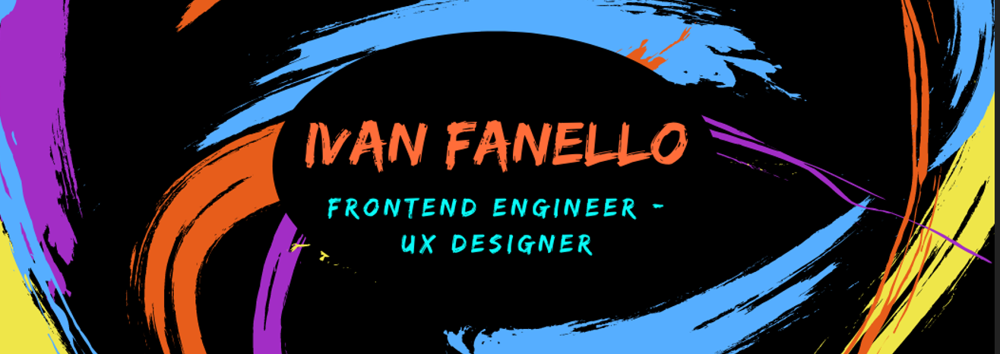

  
 
 
# Ciao! 👋🖖

Thank you for visiting my profile!

My Name is Ivan and after working as a manager in bars and restaurants for the last six year I decided to change my life completely to follow my dreams. 🔌 💻

I have just finished School of code's bootcamp and now I feel ready for a position in tech. 👨‍💻

  
  
  
---------------------------
## Tech Stack:

             

------------------------

## My Passions

------------------------

